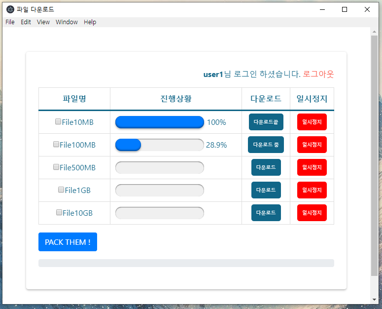

# Electron File Download

**This is a desktop application built with Electron to display a download progress bar based on file sizes. **

## Features
- Built a download progress bar that shows progress based on file size using the `request` module.
- Utilized streaming and piping for downloading large files efficiently.
- Supports downloading files of various sizes (10MB, 100MB, 500MB, 1GB, 10GB).
- Integrated `JSZipUtils` for handling zip file compression.

## Features
- **Electron**: For creating the desktop application.
- **request**: For handling HTTP requests and implementing the download -- progress bar.
- **stream, pipe**: For efficient file download, especially for large files.
- **JSZipUtils**: For zip file compression.

## Installation
1. Clone the repository:
```bash
git clone https://github.com/9aram/Electron_filedownload
```
2. Navigate into the project directory:
```bash
cd Electron_filedownload
```
3. Install dependencies:
```bash
npm install
```
4. Start the app:
```bash
npm start
```
This is a minimal Electron application based on the [Quick Start Guide](https://electronjs.org/docs/tutorial/quick-start) within the Electron documentation.


**Use this app along with the [Electron API Demos](https://electronjs.org/#get-started) app for API code examples to help you get started.**

A basic Electron application needs just these files:

- `package.json` - Points to the app's main file and lists its details and dependencies.
- `main.js` - Starts the app and creates a browser window to render HTML. This is the app's **main process**.
- `index.html` - A web page to render. This is the app's **renderer process**.

You can learn more about each of these components within the [Quick Start Guide](https://electronjs.org/docs/tutorial/quick-start).

## To Use

To clone and run this repository you'll need [Git](https://git-scm.com) and [Node.js](https://nodejs.org/en/download/) (which comes with [npm](http://npmjs.com)) installed on your computer. From your command line:

```bash
# Clone this repository
git clone https://github.com/electron/electron-quick-start
# Go into the repository
cd electron-quick-start
# Install dependencies
npm install
# Run the app
npm start
```

## Resources for Learning Electron

- [electronjs.org/docs](https://electronjs.org/docs) - all of Electron's documentation
- [electronjs.org/community#boilerplates](https://electronjs.org/community#boilerplates) - sample starter apps created by the community
- [electron/electron-quick-start](https://github.com/electron/electron-quick-start) - a very basic starter Electron app
- [electron/simple-samples](https://github.com/electron/simple-samples) - small applications with ideas for taking them further
- [electron/electron-api-demos](https://github.com/electron/electron-api-demos) - an Electron app that teaches you how to use Electron
- [hokein/electron-sample-apps](https://github.com/hokein/electron-sample-apps) - small demo apps for the various Electron APIs

## License

[CC0 1.0 (Public Domain)](LICENSE.md)
